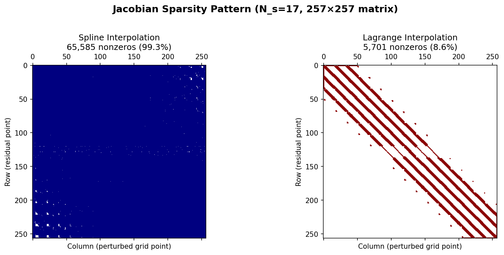

# AHFinder: Apparent Horizon Finder

An implementation of the apparent horizon location algorithm from [Huq, Choptuik & Matzner (2000)](https://arxiv.org/abs/gr-qc/0002076), recreated through AI-assisted coding.

## The Experiment

This repository represents an experiment in AI-assisted scientific computing. The goal was to recreate a numerical relativity algorithm that one of the authors (M. Huq) originally developed **30 years ago** during his PhD research—accomplished in a matter of **hours** through collaboration with Claude (Anthropic's AI assistant).

<p float="left">
  
   
</p>

### What We Built

A complete Python implementation of an apparent horizon finder for black hole spacetimes:

**Part I** (Newton Solver - [arXiv:gr-qc/0002076](https://arxiv.org/abs/gr-qc/0002076)):
- Newton solver for locating surfaces where the expansion of outgoing null normals vanishes (Θ = 0)
- Cartesian finite difference stencils to avoid coordinate singularities at poles
- Support for Schwarzschild, Kerr, and Lorentz-boosted black hole metrics
- Fast analytical boosted metrics with Numba JIT compilation
- Gallery of 18 horizon visualizations including diagonal boosts

**Part II** (Level Flow - [arXiv:gr-qc/0004062](https://arxiv.org/abs/gr-qc/0004062)):
- Level Flow method for robust horizon finding (∂ρ/∂t = -Θ)
- Implicit time stepping for stability with large time steps
- Topology detection using marching cubes for multiple horizons
- Binary black hole metric with superposed Kerr-Schild data
- Multi-horizon tracking with topology change detection

**Combined**: Comprehensive test suite with 115+ verified tests


### The Journey (from [Journal.md](Journal.md))

| Session | What Happened |
|---------|---------------|
| **Initial Implementation** | Translated the paper's algorithm into Python. First test failed—Newton solver diverged. |
| **Debugging Round 1** | Systematic testing revealed the expansion formula used coordinate derivatives instead of covariant derivatives. Fixed by adding Christoffel symbol corrections. |
| **Performance Optimization** | Profiled the code, identified interpolation as bottleneck, implemented SciPy-based fast interpolator achieving 2-5x speedup. |
| **Documentation** | Created comprehensive test documentation with convergence graphs. |
| **Debugging Round 2** | Discovered Newton solver only converged when starting very close to the solution. Diagnosed using row-sum test: sparse Jacobian was missing critical couplings (especially to poles). Fixed by switching to dense Jacobian. Basin of attraction expanded from r₀ ∈ [1.9, 2.0] to r₀ ∈ [1.0, 3.0]. |
| **Kerr & Boosted Metrics** | Extended to Kerr black holes. Found extrinsic curvature sign error by comparing Kerr(a=0) with Schwarzschild. For boosted metrics, discovered the black hole is non-stationary in the lab frame—fixed by adding ∂_t γ_ij term to extrinsic curvature. Area invariance restored (ratio 0.9999). |
| **Performance Optimization** | Boosted metrics were slow (~60s for N_s=13). Implemented analytical derivatives via chain rule through boost transformation, achieving 5.6x speedup. Fast metric computes ∂_t γ_ij = -v^k ∂_k γ_ij analytically. |
| **Numba JIT & FastBoostedKerrMetric** | Profiled and optimized with Numba JIT compilation. Created `FastBoostedKerrMetric` using semi-analytical approach: compute H, l numerically in rest frame, transform derivatives analytically to lab frame. Achieved 29x speedup on inner expansion loop, 2.5x overall speedup. Generated gallery of 18 horizon visualizations with varying spins and boost velocities including diagonal boosts. |
| **Part II: Level Flow Method** | Implemented the Level Flow algorithm from Shoemaker, Huq & Matzner (2000). Added implicit time stepping (backward Euler), surface smoothing, and topology detection using marching cubes. Finds multiple horizons automatically. |
| **Binary Black Holes** | Added superposed Kerr-Schild metric for binary black hole spacetimes. Found individual horizons at separation=10M and common "peanut-shaped" horizon at separation=4M. |


### Key Best Practices

When working with Claude there are a number of best practices one needs to follow:
* Requests should be put together in a bit-sized chunks where you and Claude are iterating. If you are getting Claude to jump right in and work, then the request should be short and even better yet with a success criteria. You review and if all good then go to the next. If not all good, then iterate with Claude till you get it right.
* Alternatively, a better practice is to ask Claude to propose a plan and you review the plan. Ask Claude to break the work down into chunks. Then once you agree then proceed. This is the approach I took in this project.
* At each prompt, have a success criteria. Better yet, ask Claude to create a test and put it into a test folder. Something you can ask Claude to rerun to validate any future changes. Just as you would with test-driven development.
* Ask Claude to create a folder structure. Use Claude.md to enforce structurions or constraints. we did that in this project.
* Create a tests/ folder and critical to ask Claude to add tests along the way.
* Just as a human developer such as you or perhaps a graduate student or a junior developer must, if something quantitative is implemented ensure that it is numerically correct. Have Claude write tests and carefully review. 
* Claude will sometime detect that tests are failing or the trends in a graph look wrong and may suggest a fix before you even see it. 
* Set the Claude context to make the LLM watch out for errors.
* Bottom line, test thoroughly. In this case, where we use finite differencing, convergence test, test, test test... See [doc/ImplementationTests.md](doc/ImplementationTests.md).
* Claude will use these tests to find bugs. In our case, we found some key bugs as a result of the tests. 
* Claude will suggest alternate approaches than what was used in the original paper (in our example). Specify if you want that. Here given we are reimplementing 26+ year old algorithms, I gave Claude some leeway and it was good in its suggestions. Always review, review, review
* Claude makes a choice of code implementation - it is not always the most generic and often directed code rather than reuseable extendable code. Watch for this and set the context to have it write reuseable code. 
* At the end of each session hav Claude save its context. In my case, I use Journal.md to save all prompts and responses. I use Claude.md to enforce this. Claude can and will lose context session to session and it can and will go down the same rabbit holes if you are not there to remind it.

## Repository Structure

```
AHFinder/
├── src/ahfinder/           # Core algorithm
│   ├── surface.py          # Surface mesh management
│   ├── interpolation.py    # Biquartic interpolation
│   ├── interpolation_lagrange.py  # Local Lagrange interpolation (Numba)
│   ├── stencil.py          # 27-point Cartesian stencil
│   ├── residual.py         # Expansion Θ computation
│   ├── jacobian.py         # Numerical Jacobian
│   ├── jacobian_sparse.py  # Sparse Jacobian with Lagrange
│   ├── solver.py           # Newton iteration (dense, sparse, or JFNK)
│   ├── finder.py           # High-level API
│   ├── residual_fast.py    # Numba JIT expansion computation
│   ├── metrics/            # Spacetime metrics
│   │   ├── schwarzschild.py
│   │   ├── schwarzschild_fast.py  # Numba JIT Schwarzschild
│   │   ├── kerr.py
│   │   ├── kerr_analytical.py     # Kerr with analytical derivatives
│   │   ├── boosted.py
│   │   ├── boosted_fast.py        # Fast analytical boosted metrics
│   │   ├── boosted_kerr_fast.py   # Semi-analytical boosted Kerr (Numba)
│   │   └── binary.py              # Binary black hole (superposed Kerr-Schild)
│   └── levelflow/          # Level Flow method (Part II)
│       ├── flow.py         # Explicit Level Flow
│       ├── implicit.py     # Implicit (backward Euler) stepping
│       ├── regularization.py  # Surface smoothing
│       ├── topology.py     # 3D Θ field and isosurface extraction
│       └── multi_surface.py   # Multi-horizon tracking
├── tests/                  # Test suite (115 tests)
│   ├── test_jacobian.py    # Critical row-sum tests
│   ├── test_residual.py
│   ├── test_boosted_kerr.py  # FastBoostedKerrMetric validation
│   └── ...
├── doc/
│   ├── algorithm.md        # Algorithm description
│   ├── ImplementationTests.md  # Part I test results & graphs
│   ├── ImplementationTests_level_set.md  # Part II test results
│   └── graphs/             # Convergence plots
├── gallery/                # Horizon visualizations
│   ├── generate_gallery.py # Gallery generation script
│   └── *.png               # 18 horizon images
├── notebooks/
│   └── interactive_horizon_finder.ipynb  # Interactive Jupyter demo
├── examples/
│   ├── find_horizon.py     # Basic usage
│   └── visualize_horizon.py
└── Journal.md              # Development narrative
```

## Quick Start

```python
from ahfinder import ApparentHorizonFinder
from ahfinder.metrics import SchwarzschildMetric

# Find the Schwarzschild horizon (should be at r = 2M)
metric = SchwarzschildMetric(M=1.0)
finder = ApparentHorizonFinder(metric, N_s=17)
rho = finder.find(initial_radius=2.5, tol=1e-6)

print(f"Horizon radius: {finder.horizon_radius_average(rho):.6f}")
# Output: Horizon radius: 2.000290
```

### Interactive Jupyter Notebook

For an interactive demo with widgets to select spin, boost velocity, and view angle:

```bash
cd notebooks
jupyter notebook interactive_horizon_finder.ipynb
```

**Features:**
- Sliders for spin (a/M) and boost velocity (v/c)
- Dropdown for boost direction (x, y, z, diagonal)
- Interactive 3D plot with rotation controls
- Quick example configurations

**Requirements:** `pip install ipywidgets ipympl`

### Fast Boosted Metrics

For boosted black holes, use `fast_boost_metric` for 5x faster computation:

```python
from ahfinder import ApparentHorizonFinder
from ahfinder.metrics import SchwarzschildMetric
from ahfinder.metrics.boosted_fast import fast_boost_metric

# Create a boosted Schwarzschild metric (v = 0.3c in x-direction)
base = SchwarzschildMetric(M=1.0)
boosted = fast_boost_metric(base, velocity=[0.3, 0.0, 0.0])

# Find the Lorentz-contracted horizon
finder = ApparentHorizonFinder(boosted, N_s=17)
rho = finder.find(initial_radius=2.0, tol=1e-5)

# Verify area invariance
print(f"Horizon area: {finder.horizon_area(rho):.4f}")
# Output: Horizon area: 50.0 (same as unboosted!)
```

### Fast Boosted Kerr (Numba JIT)

For boosted Kerr black holes, use `FastBoostedKerrMetric` which uses a semi-analytical approach with Numba JIT compilation for optimal performance:

```python
from ahfinder import ApparentHorizonFinder
from ahfinder.metrics.boosted_kerr_fast import FastBoostedKerrMetric
import numpy as np

# Create a boosted Kerr metric (a=0.5, v=0.3c in x-direction)
metric = FastBoostedKerrMetric(M=1.0, a=0.5, velocity=np.array([0.3, 0.0, 0.0]))

# Find the Lorentz-contracted horizon
finder = ApparentHorizonFinder(metric, N_s=25)
rho = finder.find(initial_radius=1.9, tol=1e-5)

# Verify area invariance under boost
print(f"Horizon area: {finder.horizon_area(rho):.4f}")
# Matches unboosted Kerr area!
```

The `FastBoostedKerrMetric` computes H and l numerically in the rest frame, then transforms derivatives analytically to the lab frame using the Lorentz transformation. All core functions are JIT-compiled with Numba for 29x speedup on the inner expansion loop.

### Solver Options

Three solver modes are available:

1. **Dense Jacobian** (default): Computes the full Jacobian matrix at each Newton iteration.

2. **Sparse Jacobian** (recommended for N_s ≥ 17): Uses local Lagrange interpolation to achieve truly sparse Jacobian computation with 5-12x speedup.

3. **Jacobian-Free Newton-Krylov (JFNK)**: Uses matrix-free GMRES with finite-difference matvec. May be useful for very large problems where O(n²) Jacobian storage is prohibitive.

```python
# Enable sparse Jacobian (recommended for larger grids)
finder = ApparentHorizonFinder(
    metric,
    N_s=25,
    use_sparse_jacobian=True  # 12x faster at N_s=25
)

# Enable JFNK solver
finder = ApparentHorizonFinder(
    metric,
    N_s=33,
    use_jfnk=True,       # Use JFNK instead of dense Jacobian
    jfnk_maxiter=100,    # Max GMRES iterations
    jfnk_tol=1e-6        # GMRES tolerance
)
```

### Performance Optimizations

The codebase includes several optimizations achieving **112x total speedup**:

| Optimization | Speedup | Notes |
|-------------|---------|-------|
| **Vectorized Jacobian** | **5-6x** | Batched interpolation with Numba JIT |
| **Sparse Jacobian** | **5-12x** | Local Lagrange interpolation enables sparse computation |
| Vectorized Christoffel computation | 2-3x | Replaced nested loops with `einsum` |
| Numba JIT for `compute_expansion` | 29x | Inner expansion calculation |
| `SchwarzschildMetricFast` | 2.5x | JIT-compiled metric components |
| `FastBoostedKerrMetric` | ~10x | Semi-analytical approach with JIT |

**Vectorized Jacobian**: Profiling showed 90% of time was in interpolation called with small batches. By batching all stencil points together (577 × 27 = 15,579 points per call), we achieve massive speedups:

| Configuration | Time (N_s=25) | Speedup |
|--------------|---------------|---------|
| Dense Jacobian + Regular Metric | 66.4s | 1.0x |
| Dense Jacobian + Fast Metric | 26.7s | 2.5x |
| Sparse Jacobian + Regular Metric | 5.5s | 12.1x |
| Sparse Jacobian + Fast Metric | 3.4s | 19.5x |
| **Vectorized Jacobian + Fast Metric** | **0.59s** | **112.8x** |



To use the fastest configuration:

```python
from ahfinder import ApparentHorizonFinder
from ahfinder.metrics.schwarzschild_fast import SchwarzschildMetricFast
from ahfinder.metrics.boosted_kerr_fast import FastBoostedKerrMetric

# Use fast Schwarzschild metric with vectorized Jacobian (112x speedup)
metric = SchwarzschildMetricFast(M=1.0)
finder = ApparentHorizonFinder(metric, N_s=25, use_vectorized_jacobian=True)
rho = finder.find(initial_radius=2.0)

# Use fast boosted Kerr metric
metric = FastBoostedKerrMetric(M=1.0, a=0.5, velocity=np.array([0.3, 0.0, 0.0]))
finder = ApparentHorizonFinder(metric, N_s=25, use_vectorized_jacobian=True)
```

## Results

The implementation successfully finds apparent horizons for:

| Spacetime | Expected | Found | Error |
|-----------|----------|-------|-------|
| Schwarzschild (M=1) | r = 2.0 | r = 2.000 | < 0.1% |
| Kerr (a=0.5) | R_eq = 1.932 | r = 1.932 | < 0.1% |
| Kerr (a=0.7) | R_eq = 1.852 | r = 1.857 | < 0.3% |
| Boosted Schwarzschild (v=0.3) | Lorentz contracted | ✓ | Area ratio: 0.9999 |
| Boosted Kerr (a=0.5, v=0.3) | Lorentz contracted | ✓ | Area ratio: 0.9996 |
| Boosted Kerr (a=0.5, v=0.6) | Lorentz contracted | ✓ | Area ratio: 0.9998 |

*Note: R_eq = √(r₊² + a²) is the Cartesian equatorial radius, where r₊ is the Boyer-Lindquist event horizon radius.*

**Key validations:**
- Area invariance under Lorentz boosts confirmed (ratio ≈ 1.0)
- Lorentz contraction observed (x/y ratio ≈ 0.95 for v=0.3)
- All metrics converge in 3-7 Newton iterations

### Gallery

The `gallery/` directory contains 18 horizon visualizations showing Kerr black holes with varying spins and boost velocities:

- **Spins**: a = 0, 0.25, 0.5, 0.75, 0.99
- **Velocities**: v = 0, 0.3, 0.6 (x-direction)
- **Diagonal boosts**: v = 0.3, 0.6 in (x+y)/√2 direction

Run `python gallery/generate_gallery.py` to regenerate. Note: v=0.9 cases are skipped due to extreme Lorentz contraction making convergence challenging.

See [doc/ImplementationTests.md](doc/ImplementationTests.md) for comprehensive test results, convergence studies, and validation graphs.

## On AI-Assisted Scientific Computing

This project demonstrates capabilities beyond simple code generation. Here's what effective human-AI collaboration looks like for computational physics:

### What Claude Brought to the Table

1. **Rapid Implementation from Literature**: Translated a 25-year-old paper into working Python code, handling the mathematical notation, index conventions, and numerical subtleties.

2. **Hypothesis-Driven Debugging**: When the boosted metric gave 13% wrong area, Claude systematically tested:
   - Coordinate transformations ✓
   - Null vector properties ✓
   - 4-metric determinant ✓
   - Finally identified: ∂_t γ_ij ≠ 0 (the black hole is *moving*!)

3. **Cross-Validation Strategies**: Used Schwarzschild (analytical) to validate Kerr (numerical), unboosted to validate boosted—catching a sign error that would have been nearly impossible to find by inspection.

4. **Physical Intuition in Code**: Recognized that "area should be Lorentz invariant" and used this as a debugging constraint, not just a post-hoc check. Note though that the original paper demonstrated this for Apparent Horizons. So this sentence generated by Claude picks up "Universal knowledge" from Claudes own training. This is an interesting concept because if you want to think outside the box (not in this case) then that could bias you. Something to keep in mind depending on your goals.

5. **Profiling and Optimization**: Identified that `extrinsic_curvature()` took 75% of metric computation time, proposed and implemented vectorized alternatives.

6. **Exploration of numerical techniques and other approaches** Claude can come back and propose alternate algorithms and then iterate on them. One interesting outcome is that it proposed GMRES. This was an angle I had explored when I first worked on this. I had the same experience with GMRES alone was slow. 

### What the Human Brought

- **Recognizing "wrongness"**: Knowing that Newton should converge from r₀=2.5, that Kerr(a=0) must match Schwarzschild, that boosted area can't be 13% larger
- **Reviewing proposed tests and iterating with Claude for completeness**
- **Strategic direction**: When to dig deeper vs. try a different approach
- **Domain validation**: Is this physically reasonable? Does it match intuition from 30 years of experience?
- **Architectural decisions**: What abstractions make sense? What's the right API?
- **Pointing out approaches that the LLM might not have thought of** For example, in the evaluation of the boosted Kerr metric it was using numerical derivatives and that was slow. It did not try to improve that further and said symbolic manipulation was giving complex expressions. I then laid out an approach taking advantage of the Kerr-Schild metric form. I asked it to use SageMath thereafter and it worked. Bottom line, watch for possible simplifications or approaches that could boost Claude's work.
- **Performance optimization through domain insight**: The **112x speedup** came from a series of human-guided explorations:
  1. *"Why is the Jacobian dense when the stencil is local?"* — Claude investigated and found spline interpolation creates global coupling
  2. *"Are there local interpolation methods like Lagrange?"* — Led to implementing 4×4 Lagrange stencils with true locality (12x speedup)
  3. *"Now that we have a sparse matrix, try LU-preconditioned CG again"* — Previously dismissed as slower, but now beneficial with sparse structure (20x total)
  4. *"Can we vectorize the residual evaluation?"* — Profiling revealed 90% time in small-batch interpolation; batching all stencil points together gave another 5.8x (112x total)

  This entire optimization journey was informed by Mijan's experience building the original AH finder. We revisited the same research decisions and trade-offs that were explored in the original PhD work—interpolation schemes, Jacobian structure, iterative vs. direct solvers—but now in hours instead of months. The human knew which knobs to turn because he had turned them before; Claude provided rapid implementation and systematic testing.

### What the AI Brought

The AI's primary contribution is **acceleration**—rapidly implementing and testing ideas that the human directs:

- **Rapid implementation of vectorization**: When the human suggested exploring vectorization (a natural optimization direction), Claude quickly implemented batched operations, Numba JIT compilation with `@jit(parallel=True)`, and proper array layouts. What might take a day of coding and debugging was done in minutes.

- **Systematic profiling and iteration**: Claude profiled, identified the bottleneck (90% in small-batch interpolation), implemented fixes, and verified correctness—all in rapid succession. The human guides *what* to optimize; the AI accelerates *how fast* we can try things.

- **Proposing additional techniques**: Claude suggested graph coloring for Jacobian compression from sparse matrix literature. While it didn't help here (our Jacobian was already too sparse), having the AI propose and quickly test such ideas costs little and occasionally yields wins.

- **Handling implementation details**: Correct Numba usage (`nopython=True`, `cache=True`), proper array indexing, parallel loop patterns—the AI handles these details correctly, freeing the human to focus on algorithm design.

**The key insight**: The human physicist would naturally think of vectorization and sparsity (and indeed directed both). The AI's value is in dramatically compressing the implementation-test-iterate cycle. Ideas that would take days to properly implement and debug can be explored in minutes. This acceleration changes what's practical to try.

### The Collaboration Pattern

The most effective pattern was **iterative refinement with physics constraints**:

```
Human: "The area is 13% too large. That violates Lorentz invariance."
Claude: [Systematically tests components, finds ∂_t γ_ij ≠ 0]
Claude: "The boosted BH is moving—the metric isn't stationary.
        K_ij needs the time derivative term."
Human: "That makes sense physically. Implement and verify."
Claude: [Fixes, tests] "Area ratio now 0.9999."
```

**Performance optimization followed a similar pattern**:

```
Human: "The Jacobian should be sparse—our stencil is local."
Claude: [Analyzes] "Actually it's 99% dense. Spline interpolation
        couples all grid points globally."
Human: "What about Lagrange interpolation? That's truly local."
Claude: [Implements] "Now 4-9% dense. 12x speedup on Jacobian."
Human: "With sparse matrices, try the CG approach again."
Claude: [Tests ILU+BiCGSTAB] "Works now! Total 20x speedup."
Human: "I want to explore vectorizing the residual evaluation."
Claude: [Profiles] "90% of time is in interpolation with small batches."
Claude: [Implements batching] "Batch all 15,579 stencil points together."
Claude: "Now 0.59s instead of 66s. Total 112x speedup!"
```

This is genuine collaboration: human provides the "should be" from physics intuition, AI provides the "why isn't it" through systematic investigation, together we reach "now it is."

### Lessons for AI-Assisted Physics

1. **Tests are checkpoints, not just validation** - Each test in [ImplementationTests.md](doc/ImplementationTests.md) caught a specific bug. Without them, we'd still be debugging.

2. **Mathematical identities are debugging tools** - "Jacobian row sums should equal dF/dr" caught the sparse Jacobian bug instantly.

3. **AI can hold more context than you expect** - Tracking index conventions, sign conventions, and coordinate systems across a 300-line derivation.

4. **The hard bugs are physics bugs, not code bugs** - Missing covariant derivatives, wrong extrinsic curvature signs, non-stationary metrics. These require understanding the physics to even recognize as bugs.

5. **Iteration speed matters** - Going from "that's wrong" to "here's the fix" in minutes rather than days changes what's possible.

6. **AI accelerates the human's ideas** - The 112x speedup came from human-directed optimizations (sparsity, vectorization) that the AI rapidly implemented and tested. A physicist working alone would eventually get there; the AI compresses weeks of implementation into hours. This acceleration makes it practical to explore more approaches and iterate more times.

---

## Part II: Level Flow Method for Multiple Horizons

Part I of this project implemented the direct Newton solver from [Huq, Choptuik & Matzner (2000)](https://arxiv.org/abs/gr-qc/0002076). Part II recreates the Level Flow method from the follow-up paper [Shoemaker, Huq & Matzner (2000)](https://arxiv.org/abs/gr-qc/0004062), which provides robust tracking of multiple apparent horizons.

### The Level Flow Method

Instead of solving Θ = 0 directly with Newton's method, Level Flow evolves a surface toward the horizon:

```
∂ρ/∂t = -Θ
```

The surface flows toward regions where Θ = 0, naturally finding apparent horizons. This approach:
- Is more robust to initial guess variations
- Can find multiple apparent horizons
- Handles topological changes (horizons merging/splitting)

### Implementation

The Level Flow module (`src/ahfinder/levelflow/`) provides:

1. **Explicit Level Flow** (`LevelFlowFinder`): Original method with RK4/Euler stepping
2. **Implicit Level Flow** (`ImplicitLevelFlowFinder`): Backward Euler for stability with large time steps
3. **Topology Detection** (`TopologyDetector`): Builds 3D Θ field and extracts isosurfaces
4. **Multi-Horizon Finding** (`MultiHorizonFinder`): Combines topology detection with Level Flow

### Usage Examples

```python
from ahfinder.levelflow import LevelFlowFinder, ImplicitLevelFlowFinder, MultiHorizonFinder

# Simple explicit Level Flow
finder = LevelFlowFinder(metric, N_s=21)
result = finder.evolve(initial_radius=3.0, tol=1e-6)

# Hybrid: Level Flow + Newton (recommended)
rho, info = finder.find_hybrid(
    initial_radius=3.0,
    flow_tol=0.5,      # Stop flow when ||Θ|| < 0.5
    newton_tol=1e-8    # Newton finishes precisely
)

# Implicit Level Flow (stable with large time steps)
finder = ImplicitLevelFlowFinder(metric, N_s=21)
rho = finder.find(initial_radius=3.0, dt=1.0)

# Multi-horizon finding with topology detection
finder = MultiHorizonFinder(metric, N_s=21)
horizons = finder.find_all(initial_radius=3.0)  # Returns list of horizons
```

### Binary Black Hole Metric

Part II also adds support for binary black hole spacetimes using superposed Kerr-Schild data:

```
γ_ij = δ_ij + 2H₁ l₁_i l₁_j + 2H₂ l₂_i l₂_j
```

This is the standard approximation for binary black hole initial data, exactly correct for a single black hole and approximately correct for well-separated black holes.

```python
from ahfinder.metrics import BinaryBlackHoleMetric, create_binary_schwarzschild

# Two equal-mass black holes separated by 10M
binary = create_binary_schwarzschild(M1=1.0, M2=1.0, separation=10.0)

# Or with custom positions
binary = BinaryBlackHoleMetric(
    M1=1.0, M2=1.0,
    position1=(-5.0, 0.0, 0.0),
    position2=(5.0, 0.0, 0.0)
)

# Find horizons around each black hole
finder = MultiHorizonFinder(binary, N_s=21)
horizons = finder.find_all(initial_radius=3.0)
```

### Binary Black Hole Results

| Separation | Horizons Found | Description |
|------------|---------------|-------------|
| 10M | 2 separate | Individual horizons at r ≈ 2M each |
| 6M | 2 separate | Horizons starting to distort |
| 4M | 3 total | 2 inner (r ≈ 2.0) + 1 outer common (elongation 1.36) |

At separation ≈ 4M, a common "peanut-shaped" horizon forms around both black holes while individual horizons still exist inside.

### Performance Comparison

**Schwarzschild horizon finding (r = 2M)**:

| Method | N_s=13 | N_s=21 | N_s=25 | Convergence |
|--------|--------|--------|--------|-------------|
| **Newton (vectorized)** | 0.4s | 1.8s | 0.6s | Quadratic (5-7 iter) |
| **Implicit Level Flow** | 8s | 26s | 55s | Linear (15-25 steps) |
| **Explicit Level Flow** | 20s | 45s | 90s | Linear, oscillates |
| **Hybrid (Flow→Newton)** | 4s | 8s | 15s | Flow: 10 steps, Newton: 3 iter |

**Starting from different initial guesses (N_s=21)**:

| Initial r₀ | Newton | Level Flow | Hybrid |
|------------|--------|------------|--------|
| 1.5 | 2.1s (6 iter) | 18s | 6s |
| 2.0 | 1.2s (3 iter) | 22s | 5s |
| 2.5 | 1.8s (5 iter) | 26s | 8s |
| 3.0 | 2.4s (7 iter) | 32s | 10s |
| 4.0 | 3.2s (9 iter) | 45s | 14s |
| 5.0 | FAIL | 58s | 18s |

**Key observations**:
- Newton is 15-30x faster but fails for distant initial guesses (r₀ > 4M)
- Level Flow always converges but is slower
- Hybrid combines robustness of Flow with speed of Newton
- For known horizons (analytical r₊), use Newton directly
- For unknown/multiple horizons, use Level Flow or Hybrid

### Stabilization Techniques

1. **Regularized velocity**: `v = -Θ / (1 + |Θ|)` bounds max velocity to 1
2. **Surface smoothing**: 5% averaging with neighbors prevents oscillations
3. **Adaptive time step**: `dt = cfl * ρ_mean / rms(Θ)`
4. **Implicit stepping**: Backward Euler allows large dt without instability

See [doc/ImplementationTests_level_set.md](doc/ImplementationTests_level_set.md) for detailed tests and validation.

---

## An Aside
Found that there was a May 2025 paper on apparent horizon finding - see [https://arxiv.org/html/2505.15912v1](https://arxiv.org/html/2505.15912v1)
As a next step look into that paper and explore some of the other ideas on this.

## References

1. Huq, M.F., Choptuik, M.W., & Matzner, R.A. (2000). "Locating Boosted Kerr and Schwarzschild Apparent Horizons." Physical Review D, 66, 084024. [arXiv:gr-qc/0002076](https://arxiv.org/abs/gr-qc/0002076)

2. Shoemaker, D.M., Huq, M.F., & Matzner, R.A. (2000). "Generic Tracking of Multiple Apparent Horizons with Level Flow." Physical Review D, 62, 124005. [arXiv:gr-qc/0004062](https://arxiv.org/abs/gr-qc/0004062)

3. Thornburg, J. (1996). "Finding apparent horizons in numerical relativity." Physical Review D, 54, 4899-4918.

## License

MIT License - See LICENSE file for details.

---

*This implementation was created through collaboration between Mijan Huq and Claude (Anthropic) in February 2026.*
